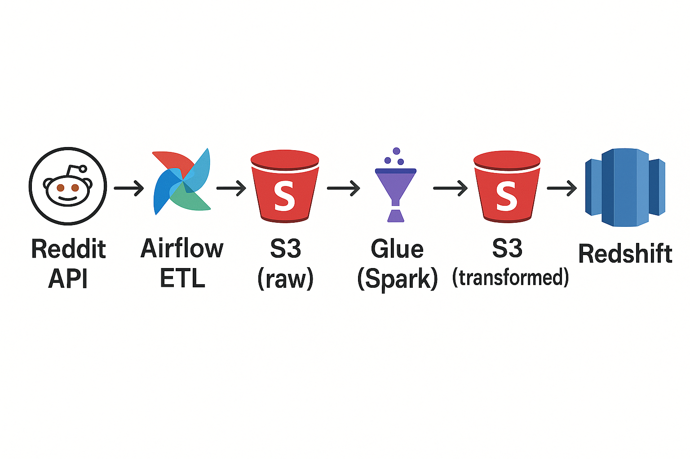

# 🧠 Reddit ETL Pipeline: From Reddit API to Redshift via Airflow, S3, and Glue

A complete data pipeline to **Extract**, **Transform**, and **Load** (ETL) Reddit data into an AWS Redshift data warehouse using modern cloud and orchestration tools.

---

## 🗺️ Table of Contents

* [🔍 Project Overview](#ProjectOverview)
* [⚙️ Stack & Technologies](#StackTechnologies)
* [🛠️ Pipeline Steps](#PipelineSteps)
* [🚀 Quick Start](#QuickStart)
* [📘 What I Learned](#WhatILearned)

---

##  1. <a name='ProjectOverview'></a>🔍 Project Overview

This pipeline illustrates the complete lifecycle of ingesting data from **Reddit subreddits** and preparing it for advanced analysis and visualization in a **cloud-based data warehouse**.

---

##  2. <a name='StackTechnologies'></a>⚙️ Stack & Technologies

**Tools:** Docker, Airflow, AWS S3, AWS Glue, AWS Redshift
**Libraries/Tech:** `praw`, `pandas`, `numpy`, `s3fs`, `pytest`, `unittest`, `logging`

---

##  3. <a name='PipelineSteps'></a>🛠️ Pipeline Steps



1. **Scrape** data from Reddit using the `praw` API.
2. **Transform** the data with `pandas`.
3. **Push** the raw data to AWS S3 using `s3fs`.
4. **Automate** steps 1–3 using **Airflow DAGs**.
5. **Run Spark-based ETL jobs** using **AWS Glue**.
6. **Apply additional transformations** and move cleaned data to another S3 bucket.
7. **Load the final dataset** into **Amazon Redshift**, making it ready for BI tools like **Power BI** or **Tableau**.

---

##  4. <a name='QuickStart'></a>🚀 Quick Start

1. **Clone the repository:**

   ```bash
   git clone https://github.com/NotAbdelrahmanelsayed/Reddit_ETL.git
   cd Reddit_ETL
   ```

2. **Create the configuration file:**

   ```bash
   touch config/config.conf
   ```

3. **Set up your credentials:**

   * Get Reddit API keys from [reddit.com/prefs/apps](https://www.reddit.com/prefs/apps)
   * Get AWS credentials as described in [this AWS CLI guide](https://docs.aws.amazon.com/cli/v1/userguide/cli-configure-files.html)

4. **Fill in `config/config.conf`**
   Use `config_example.conf` as a reference template.

5. **Start Airflow and services:**

   ```bash
   docker compose up -d
   ```

6. **Access the Airflow UI**
   Open your browser and go to: [http://localhost:8080](http://localhost:8080)

7. **Trigger the DAG** to run the full ETL process.

---

##  5. <a name='WhatILearned'></a>📘 What I Learned

* Spent **15+ hours debugging Airflow**, which taught me more than most tutorials.
* Deep-dived into **AWS documentation**, improving my understanding of real-world AWS usage.
* Explored **various AWS settings**, which opened my eyes to configuration flexibility for different use cases.
* Learned the **basics of Apache Spark** while scripting AWS Glue jobs.
* Practiced **creative testing** using mocking and patching to isolate components cleanly.
* Enhanced my skills in **Docker and Docker Compose** while managing the couple container setup.